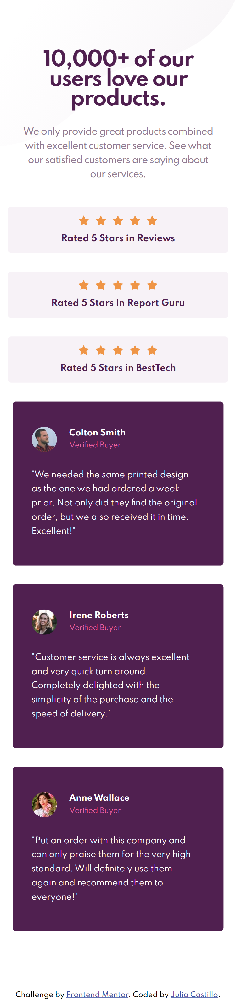

# Frontend Mentor - Social proof section solution

This is a solution to the [Social proof section challenge on Frontend Mentor](https://www.frontendmentor.io/challenges/social-proof-section-6e0qTv_bA). Frontend Mentor challenges help you improve your coding skills by building realistic projects. 

Started on 23/07/2021.

Finished on 28/07/2021.

Approx time spent on it: 4 hours.

## Table of contents

- [Overview](#overview)
  - [The challenge](#the-challenge)
  - [Screenshot](#screenshot)
  - [Links](#links)
- [My process](#my-process)
  - [Built with](#built-with)
  - [What I learned](#what-i-learned)
  - [Useful resources](#useful-resources)
- [Author](#author)

## Overview

### The challenge

Users should be able to:

- View the optimal layout for the section depending on their device's screen size

### Screenshot

### Links

- Solution URL: [Solution URL here](https://www.frontendmentor.io/solutions/mobilefirst-social-proof-site-using-flexbox-and-grid-pXiqxLpg7)
- Live Site URL: [Live site URL here](https://juliacastillo.github.io/FM-social-proof-section/)

## My process

### Built with

- Semantic HTML5 markup
- CSS custom properties
- Flexbox
- CSS Grid
- Mobile-first workflow

### What I learned

- Practiced the use of pseudo-classes
- Practised combining flexbox and grid
- Learned that auto padding doesn't exist

### Useful resources

I'm still learning about flexbox and grid so these tow resources helped a lot:

- [A Complete Guide to Flexbox](hhttps://css-tricks.com/snippets/css/a-guide-to-flexbox/)
- [A Complete Guide to Grid](https://css-tricks.com/snippets/css/complete-guide-grid/)

## Author

- Frontend Mentor - [@JuliaCastillo](https://www.frontendmentor.io/profile/JuliaCastillo)

